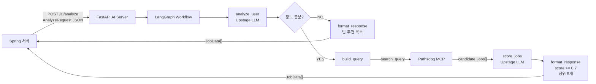

# AI Server

FastAPI와 LangGraph 기반 채용공고 추천 AI 서버입니다. Spring 서버가 자기소개서와 희망 조건을 `POST /ai/analyze`로 전달하면, AI 서버는 Upstage LLM으로 사용자 정보를 분석하고 Pathsdog MCP에서 채용공고를 검색한 뒤 적합도 점수를 매겨 추천 공고 목록을 반환합니다.

## 프로젝트 구조

```text
ai_server/
├── main.py                         # FastAPI 앱 진입점, /health 등록
├── requirements.txt                # Python 의존성
├── .env.example                    # 환경변수 예시 파일
├── app/
│   ├── api/
│   │   ├── routes.py               # /ai/analyze API 라우트
│   │   └── schemas.py              # 요청/응답 Pydantic 모델
│   ├── core/
│   │   ├── config.py               # .env 설정 로딩
│   │   └── llm.py                  # Upstage LLM 클라이언트
│   ├── graph/
│   │   ├── state.py                # LangGraph 상태 타입
│   │   ├── workflow.py             # LangGraph 노드 연결
│   │   └── nodes/
│   │       ├── analyze_user.py     # 자기소개서 기반 사용자 분석
│   │       ├── check_completeness.py
│   │       ├── build_query.py      # Pathsdog 검색 파라미터 생성
│   │       ├── search_jobs.py      # 채용공고 검색
│   │       ├── score_jobs.py       # 공고 적합도 평가
│   │       └── format_response.py  # 최종 응답 포맷팅
│   ├── integrations/
│   │   └── pathsdog_mcp.py         # Pathsdog MCP 연동
│   └── prompts/
│       ├── user_analysis.md        # 사용자 분석 프롬프트
│       └── suitability_scoring.md  # 적합도 평가 프롬프트
└── tests/                          # FastAPI, LangGraph, 연동 로직 테스트
```

## 전체 흐름



## 요청 형식

Endpoint:

```http
POST /ai/analyze
Content-Type: application/json
```

Body:

```json
{
  "coverLetter": "자기소개서 전체 내용",
  "preferences": {
    "jobRole": "제조 DX 데이터 엔지니어",
    "experienceLevel": "신입",
    "techStack": ["Python", "LLM", "Azure"],
    "region": "서울",
    "onlyWithReward": false,
    "isUrgent": false
  }
}
```

## 응답 형식

성공 시 `JobData[]`를 반환합니다.

```json
[
  {
    "jobId": "395",
    "companyName": "SK실트론",
    "jobTitle": "LLM 모델 데이터 관리",
    "suitabilityScore": 0.85,
    "compensation": "원문 확인 필요",
    "deadline": "2026-04-12",
    "originalLink": "https://www.skcareers.com/Recruit/Detail/R260672",
    "analysis": {
      "matchReason": "자기소개서의 제조 데이터 경험과 공고의 업무가 잘 맞습니다.",
      "missingPoints": "직무별 상세 기술 스택 경험은 추가 확인이 필요합니다.",
      "checkpointGuide": "지원 전 공고 원문에서 담당 업무와 지원 자격을 확인하세요."
    }
  }
]
```

정보가 부족하거나 추천 가능한 공고가 없으면 빈 배열을 반환합니다.

```json
[]
```

워크플로우 실행 중 오류가 발생하면 현재 API는 `502`를 반환합니다.

```json
{
  "detail": "AI workflow failed"
}
```

## 환경변수 설정

`.env.example`을 복사해서 `ai_server/.env`를 만듭니다.

```bash
cd /Users/kanghyoseung/Documents/aisw_maestro_05/ai_server
cp .env.example .env
```

`ai_server/.env`에 실제 값을 입력합니다.

```env
UPSTAGE_API_KEY=your-upstage-api-key
UPSTAGE_BASE_URL=https://api.upstage.ai/v1
UPSTAGE_MODEL=solar-pro3
PATHSDOG_MCP_URL=https://jobs.pathsdog.com/mcp
AI_SERVER_HOST=0.0.0.0
AI_SERVER_PORT=8000
```

`ai_server/.env`는 Git에 커밋하면 안 됩니다. 루트 `.gitignore`에 `**/.env`가 추가되어 있습니다.

## 실행 방법

처음 실행할 때:

```bash
cd /Users/kanghyoseung/Documents/aisw_maestro_05/ai_server
python3 -m venv .venv
source .venv/bin/activate
pip install -r requirements.txt
uvicorn main:app --host 127.0.0.1 --port 8000
```

이미 가상환경을 만들어둔 경우:

```bash
cd /Users/kanghyoseung/Documents/aisw_maestro_05/ai_server
source .venv/bin/activate
uvicorn main:app --host 127.0.0.1 --port 8000
```

서버 상태 확인:

```bash
curl http://127.0.0.1:8000/health
```

정상 응답:

```json
{
  "status": "ok"
}
```

## 테스트 방법

```bash
cd /Users/kanghyoseung/Documents/aisw_maestro_05/ai_server
source .venv/bin/activate
UPSTAGE_API_KEY=test-key pytest -q
```

테스트에서는 실제 Upstage API 호출 대신 가짜 LLM이나 라우트 테스트용 의존성을 사용합니다.

## 자주 나는 실행 오류

루트 디렉터리에서 아래처럼 실행하면 `main.py`를 찾지 못할 수 있습니다.

```bash
.venv/bin/uvicorn main:app --host 127.0.0.1 --port 8000
```

이 서버의 `main.py`는 `ai_server/main.py`에 있으므로 `ai_server` 디렉터리로 이동한 뒤 실행해야 합니다.

```bash
cd /Users/kanghyoseung/Documents/aisw_maestro_05/ai_server
source .venv/bin/activate
uvicorn main:app --host 127.0.0.1 --port 8000
```
