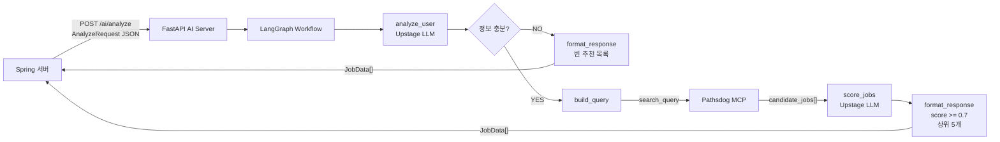

# AI Server

FastAPI와 LangGraph 기반 채용공고 추천 AI 서버입니다. Spring 서버가 자기소개서와 희망 조건을 `POST /ai/analyze`로 전달하면, AI 서버는 Upstage LLM으로 사용자 정보를 분석하고 Pathsdog MCP에서 채용공고를 검색한 뒤 적합도 점수를 매겨 추천 공고 목록을 반환합니다.

## 프로젝트 구조

```text
ai_server/
├── main.py                         # FastAPI 앱 진입점, /health 등록
├── requirements.txt                # Python 의존성
├── .env.example                    # 환경변수 예시 파일
├── app/
│   ├── api/
│   │   ├── routes.py               # /ai/analyze API 라우트
│   │   └── schemas.py              # 요청/응답 Pydantic 모델
│   ├── core/
│   │   ├── config.py               # .env 설정 로딩
│   │   └── llm.py                  # Upstage LLM 클라이언트
│   ├── graph/
│   │   ├── state.py                # LangGraph 상태 타입
│   │   ├── workflow.py             # LangGraph 노드 연결
│   │   └── nodes/
│   │       ├── analyze_user.py     # 자기소개서 기반 사용자 분석
│   │       ├── check_completeness.py
│   │       ├── build_query.py      # Pathsdog 검색 파라미터 생성
│   │       ├── search_jobs.py      # 채용공고 검색
│   │       ├── score_jobs.py       # 공고 적합도 평가
│   │       └── format_response.py  # 최종 응답 포맷팅
│   ├── integrations/
│   │   └── pathsdog_mcp.py         # Pathsdog MCP 연동
│   └── prompts/
│       ├── user_analysis.md        # 사용자 분석 프롬프트
│       └── suitability_scoring.md  # 적합도 평가 프롬프트
└── tests/                          # FastAPI, LangGraph, 연동 로직 테스트
```

## 전체 흐름



## 요청 형식

Endpoint:

```http
POST /ai/analyze
Content-Type: application/json
```

Body:

```json
{
  "coverLetter": "자기소개서 전체 내용",
  "preferences": {
    "jobRole": "백엔드 개발자",
    "experienceLevel": "신입",
    "techStack": ["Java", "Spring Boot", "JPA", "MySQL", "Redis", "Docker", "AWS"],
    "region": "서울, 경기",
    "onlyWithReward": false,
    "isUrgent": false
  }
}
```

## 응답 형식

성공 시 `JobData[]`를 반환합니다.

```json
[
  {
    "jobId": "639",
    "companyName": "김캐디",
    "jobTitle": "백엔드 개발자 포지션 (신입~3년차, 병특)",
    "suitabilityScore": 0.92,
    "compensation": "원문 확인 필요",
    "deadline": "상시채용",
    "originalLink": "https://kimcaddie.career.greetinghr.com/ko/o/206177",
    "analysis": {
      "matchReason": "Java, Spring Boot, JPA, MySQL, Redis, Docker, AWS 등 핵심 기술 스택이 공고와 잘 맞습니다.",
      "missingPoints": "실제 운영 환경에서의 장애 대응 경험과 구체적인 성능 개선 수치는 추가 확인이 필요합니다.",
      "checkpointGuide": "프로젝트 규모, 성능 개선 수치, 배포 경험을 지원서에서 구체적으로 강조하세요."
    }
  }
]
```

정보가 부족하거나 추천 가능한 공고가 없으면 빈 배열을 반환합니다.

```json
[]
```

워크플로우 실행 중 오류가 발생하면 현재 API는 `502`를 반환합니다.

```json
{
  "detail": "AI workflow failed"
}
```

## 동작 예시

아래 예시는 흔한 신입 백엔드 엔지니어 자기소개서와 선호 조건을 넣었을 때의 호출 예시입니다. 실제 추천 공고와 점수는 Pathsdog MCP의 현재 채용공고 데이터와 Upstage LLM 응답에 따라 달라질 수 있습니다.

Request:

```bash
curl -X POST http://127.0.0.1:8000/ai/analyze \
  -H "Content-Type: application/json" \
  -d '{
    "coverLetter": "저는 Java와 Spring Boot를 중심으로 웹 서비스 백엔드 개발을 학습하고 프로젝트를 진행해 온 신입 백엔드 개발자입니다. 팀 프로젝트에서 REST API 설계, JWT 인증, 일정 CRUD, 댓글, 알림 API를 담당했습니다. JPA로 엔티티 관계를 설계했고 MySQL 인덱스를 적용해 목록 조회 API의 응답 속도를 개선했습니다. Redis를 활용해 조회수 중복 집계와 캐시를 적용했고 Docker Compose로 Spring Boot, MySQL, Redis 로컬 개발 환경을 구성했습니다. AWS EC2에 애플리케이션을 배포하고 Nginx를 리버스 프록시로 설정했습니다. GitHub Pull Request 기반 코드 리뷰와 이슈 관리로 협업했으며, Service 단위 테스트와 Controller MockMvc 테스트를 작성했습니다.",
    "preferences": {
      "jobRole": "백엔드 개발자",
      "experienceLevel": "신입",
      "techStack": ["Java", "Spring", "Spring Boot", "JPA", "MySQL", "SQL", "Redis", "Docker", "AWS", "Nginx", "REST API", "JWT", "GitHub"],
      "region": "서울, 경기, 판교",
      "onlyWithReward": false,
      "isUrgent": false
    }
  }'
```

Response:

```json
[
  {
    "jobId": "639",
    "companyName": "김캐디",
    "jobTitle": "백엔드 개발자 포지션 (신입~3년차, 병특)",
    "suitabilityScore": 0.92,
    "compensation": "원문 확인 필요",
    "deadline": "상시채용",
    "originalLink": "https://kimcaddie.career.greetinghr.com/ko/o/206177",
    "analysis": {
      "matchReason": "Java, Spring Boot, JPA, MySQL, Redis, Docker, AWS, Nginx 등 핵심 기술 스택이 일치하며, REST API 설계, JWT 인증, 데이터베이스 성능 최적화, 배포 및 운영 환경 관리 경험이 요구 사항과 부합합니다.",
      "missingPoints": "구체적인 프로젝트 규모 및 팀 인원, 실제 운영 환경에서의 장애 대응 경험, 성능 개선 수치, CI/CD 파이프라인 구축 경험은 추가 확인이 필요합니다.",
      "checkpointGuide": "프로젝트 규모, 장애 대응 사례, 성능 개선 수치, CI/CD 경험, 테스트 자동화 수준을 지원 전 확인하세요."
    }
  },
  {
    "jobId": "1548",
    "companyName": "두잇",
    "jobTitle": "[전문연구요원] Software Engineer(신규, 전직)",
    "suitabilityScore": 0.88,
    "compensation": "원문 확인 필요",
    "deadline": "상시채용",
    "originalLink": "https://teamdoeat.career.greetinghr.com/ko/o/127704",
    "analysis": {
      "matchReason": "Java, Spring, JPA, Docker, AWS, Redis 등 주요 기술 스택이 일치하며, 코드 리뷰 및 협업 경험이 요구 사항과 부합합니다.",
      "missingPoints": "운영 환경 장애 대응 경험과 CI/CD 파이프라인 구축 경험은 추가 확인이 필요합니다.",
      "checkpointGuide": "백엔드 API 설계, 협업 방식, 배포 경험을 중심으로 자기소개서 내용을 보강하세요."
    }
  },
  {
    "jobId": "1535",
    "companyName": "QANDA",
    "jobTitle": "백엔드 엔지니어 (산업기능요원 / 전문연구요원)",
    "suitabilityScore": 0.85,
    "compensation": "원문 확인 필요",
    "deadline": "상시채용",
    "originalLink": "https://recruit.mathpresso.com/ko/o/179693",
    "analysis": {
      "matchReason": "Java, Spring, JPA, Docker, Redis 등 핵심 기술 스택이 일치하며, API 설계와 데이터베이스 성능 최적화 경험이 요구 사항과 부합합니다.",
      "missingPoints": "대규모 트래픽 처리 경험과 실제 서비스 운영 경험은 추가 확인이 필요합니다.",
      "checkpointGuide": "N+1 쿼리 개선, 인덱스 적용, 테스트 작성 경험을 구체적인 수치와 함께 정리하세요."
    }
  },
  {
    "jobId": "1606",
    "companyName": "HYBE",
    "jobTitle": "[Weverse Company] Back-end (경력 무관)",
    "suitabilityScore": 0.8,
    "compensation": "원문 확인 필요",
    "deadline": "상시채용",
    "originalLink": "https://careers.hybecorp.com/ko/o/210534",
    "analysis": {
      "matchReason": "Java, Spring, Redis 등 주요 백엔드 기술과 데이터베이스 성능 최적화 및 배포 경험이 공고와 관련성이 있습니다.",
      "missingPoints": "Kafka 등 메시징 시스템 경험과 대규모 서비스 운영 경험은 추가 확인이 필요합니다.",
      "checkpointGuide": "Redis 캐시, AWS 배포, API 장애 대응 경험을 중심으로 지원 가능성을 점검하세요."
    }
  },
  {
    "jobId": "1283",
    "companyName": "ESTgames",
    "jobTitle": "웹 개발자 (TypeScript, Next.js, Java, Spring)",
    "suitabilityScore": 0.75,
    "compensation": "원문 확인 필요",
    "deadline": "상시채용",
    "originalLink": "https://estfamily.career.greetinghr.com/ko/o/107360",
    "analysis": {
      "matchReason": "Java, Spring, MySQL, Redis, Docker 등 백엔드 기술 스택이 일치하며, API 설계와 데이터베이스 개선 경험이 공고와 관련됩니다.",
      "missingPoints": "TypeScript, Next.js 등 프론트엔드 기술 경험은 추가 확인이 필요합니다.",
      "checkpointGuide": "백엔드 중심 역량을 강조하되, 웹 프론트엔드 협업 경험이 있다면 함께 정리하세요."
    }
  }
]
```

최종 응답은 `suitabilityScore >= 0.7`인 공고만 남기고 점수 기준 내림차순으로 정렬합니다. 현재 구현은 최대 5개까지 반환합니다.

## 환경변수 설정

`.env.example`을 복사해서 `ai_server/.env`를 만듭니다.

```bash
cd /Users/kanghyoseung/Documents/aisw_maestro_05/ai_server
cp .env.example .env
```

`ai_server/.env`에 실제 값을 입력합니다.

```env
UPSTAGE_API_KEY=your-upstage-api-key
UPSTAGE_BASE_URL=https://api.upstage.ai/v1
UPSTAGE_MODEL=solar-pro3
PATHSDOG_MCP_URL=https://jobs.pathsdog.com/mcp
AI_SERVER_HOST=0.0.0.0
AI_SERVER_PORT=8000
```

`ai_server/.env`는 Git에 커밋하면 안 됩니다. 루트 `.gitignore`에 `**/.env`가 추가되어 있습니다.

## 실행 방법

처음 실행할 때:

```bash
cd /Users/kanghyoseung/Documents/aisw_maestro_05/ai_server
python3 -m venv .venv
source .venv/bin/activate
pip install -r requirements.txt
uvicorn main:app --host 127.0.0.1 --port 8000
```

이미 가상환경을 만들어둔 경우:

```bash
cd /Users/kanghyoseung/Documents/aisw_maestro_05/ai_server
source .venv/bin/activate
uvicorn main:app --host 127.0.0.1 --port 8000
```

서버 상태 확인:

```bash
curl http://127.0.0.1:8000/health
```

정상 응답:

```json
{
  "status": "ok"
}
```

## 테스트 방법

```bash
cd /Users/kanghyoseung/Documents/aisw_maestro_05/ai_server
source .venv/bin/activate
UPSTAGE_API_KEY=test-key pytest -q
```

테스트에서는 실제 Upstage API 호출 대신 가짜 LLM이나 라우트 테스트용 의존성을 사용합니다.

## 자주 나는 실행 오류

루트 디렉터리에서 아래처럼 실행하면 `main.py`를 찾지 못할 수 있습니다.

```bash
.venv/bin/uvicorn main:app --host 127.0.0.1 --port 8000
```

이 서버의 `main.py`는 `ai_server/main.py`에 있으므로 `ai_server` 디렉터리로 이동한 뒤 실행해야 합니다.

```bash
cd /Users/kanghyoseung/Documents/aisw_maestro_05/ai_server
source .venv/bin/activate
uvicorn main:app --host 127.0.0.1 --port 8000
```
