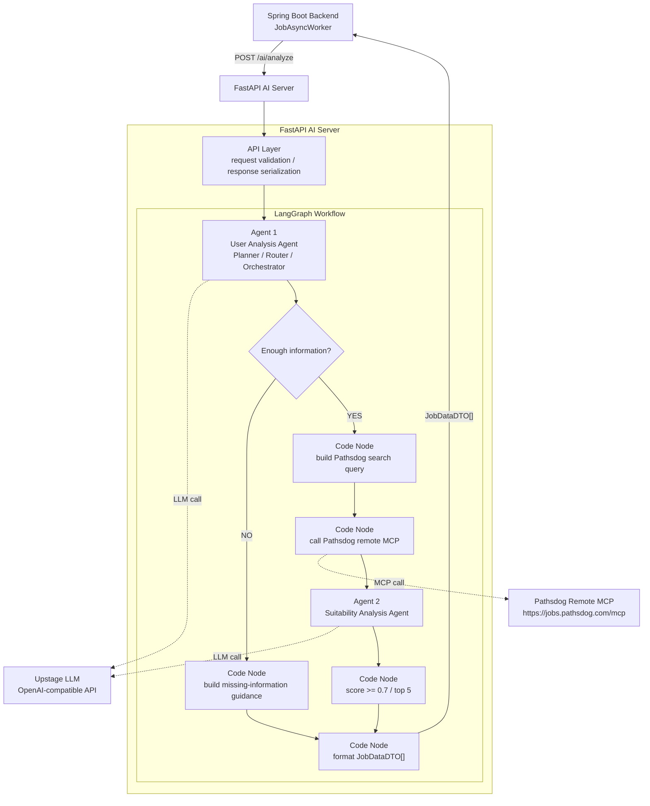

# LangGraph FastAPI AI Server Design

## Objective

Build a separate FastAPI AI server that receives the existing Spring request body from `POST /ai/analyze`, runs a LangGraph workflow that follows the project proposal, searches Pathsdog through its remote MCP server, analyzes job suitability with Upstage Solar LLM, and returns a plain `JobDataDTO[]` array to Spring.

The first implementation handles text self-introductions only. File upload, PDF parsing, DOCX parsing, and Upstage Agent Files are out of scope for this version.

## Existing Contract

Spring calls:

```http
POST http://localhost:8000/ai/analyze
```

Request body:

```json
{
  "coverLetter": "text",
  "preferences": {
    "jobRole": "백엔드 개발자",
    "experienceLevel": "신입",
    "techStack": ["Spring", "Redis", "AWS"],
    "region": "서울",
    "onlyWithReward": false,
    "isUrgent": false
  }
}
```

Response body must be a JSON array, not wrapped in `BaseResponse`:

```json
[
  {
    "jobId": "string",
    "companyName": "string",
    "jobTitle": "string",
    "suitabilityScore": 0.86,
    "compensation": "string",
    "deadline": "string",
    "originalLink": "string",
    "analysis": {
      "matchReason": "string",
      "missingPoints": "string",
      "checkpointGuide": "string"
    }
  }
]
```

The server returns at most 5 jobs. Jobs below `suitabilityScore < 0.7` are filtered out.

## Architecture



FastAPI is the server shell. The agents live inside LangGraph as LLM-powered nodes. Pathsdog MCP calls, filtering, and DTO formatting are deterministic code nodes.

## Components

### API Layer

Responsibilities:

- Expose `POST /ai/analyze`.
- Validate the Spring request body with Pydantic models.
- Run the LangGraph workflow.
- Return a plain list of `JobDataDTO` objects.
- Convert internal failures into `[]` only when the workflow can safely report no recommendations. For server or integration failures, return an HTTP 5xx so Spring stores `ERROR`.

### Agent 1: User Analysis Agent

Responsibilities:

- Extract concrete signals from `coverLetter`: project experience, role, technical stack, problem-solving examples, collaboration experience, strengths, and desired job direction.
- Combine those signals with `preferences`.
- Decide whether the input is strong enough to search jobs.
- Produce a search plan when information is sufficient.

Completeness rules:

- Sufficient input should include at least one concrete project or work experience, at least one technical skill signal, and a recognizable job direction.
- If the cover letter is too vague, the graph stops before Pathsdog MCP search.
- Because Spring currently expects only `JobDataDTO[]`, an insufficient input returns `[]`. A future Spring DTO extension can expose the generated guidance message to the frontend.

### Pathsdog MCP Search Node

Responsibilities:

- Connect directly to `https://jobs.pathsdog.com/mcp`.
- Search jobs using the query and preferences produced by Agent 1.
- Fetch or normalize enough detail for scoring: company, title, work summary, requirements, preferred skills, region, deadline, compensation or reward information, and original link.
- Deduplicate candidate jobs by stable job ID or original link.

The MCP node is deterministic code rather than an LLM agent so the integration remains testable and predictable.

### Agent 2: Suitability Analysis Agent

Responsibilities:

- Compare the analyzed user profile with each candidate job.
- Assign `suitabilityScore` from `0.0` to `1.0`.
- Generate `matchReason`, `missingPoints`, and `checkpointGuide`.
- Avoid promising acceptance probability. Explanations must frame the score as relevance between the self-introduction and the job posting.

### Filter and Formatter

Responsibilities:

- Keep jobs with `suitabilityScore >= 0.7`.
- Sort by score descending.
- Return at most 5 jobs.
- Fill missing job fields with `"원문 확인 필요"` where appropriate.
- Return exactly the JSON shape Spring already deserializes as `List<JobResponseDTO.JobDataDTO>`.

## External Services

### Upstage LLM

Use Upstage through its OpenAI-compatible chat API.

Configuration:

- `UPSTAGE_API_KEY`
- `UPSTAGE_BASE_URL=https://api.upstage.ai/v1`
- `UPSTAGE_MODEL=solar-pro3`

The API key must only be read from environment variables. It must not be committed or hardcoded.

### Pathsdog MCP

Configuration:

- `PATHSDOG_MCP_URL=https://jobs.pathsdog.com/mcp`

The design assumes no authentication for the first version, based on the public Pathsdog MCP guidance.

## Proposed File Structure

```text
ai_server/
  main.py
  requirements.txt
  .env.example
  app/
    api/
      routes.py
      schemas.py
    core/
      config.py
      llm.py
    graph/
      state.py
      workflow.py
      nodes/
        analyze_user.py
        check_completeness.py
        build_query.py
        search_jobs.py
        score_jobs.py
        format_response.py
    integrations/
      pathsdog_mcp.py
    prompts/
      user_analysis.md
      suitability_scoring.md
```

## Data Flow

1. Spring sends `coverLetter` and `preferences` to FastAPI.
2. FastAPI validates the request and invokes LangGraph.
3. Agent 1 analyzes the user profile and decides whether enough information exists.
4. If information is insufficient, the workflow returns `[]`.
5. If information is sufficient, code builds a Pathsdog search query.
6. The MCP node searches Pathsdog and normalizes candidate jobs.
7. Agent 2 scores and explains each candidate.
8. Code filters jobs below `0.7`, sorts the rest, keeps the top 5, and formats `JobDataDTO[]`.
9. Spring receives the array and stores either `COMPLETED` or `EMPTY` in Redis according to its existing logic.

## Error Handling

- Invalid request body: FastAPI returns HTTP 422.
- Upstage API failure: FastAPI returns HTTP 502.
- Pathsdog MCP connection failure: FastAPI returns HTTP 502.
- No matching jobs after valid search: return `[]`.
- Insufficient user information: return `[]` for this version.
- Malformed LLM output: retry once with a stricter prompt; if still invalid, return HTTP 502.

## Testing Strategy

- Unit tests for Pydantic request/response schemas.
- Unit tests for completeness decision with concrete, vague, and empty self-introductions.
- Unit tests for filtering: score threshold, descending order, maximum 5 results.
- Unit tests for response formatting with missing fields.
- Integration test with mocked Upstage client and mocked Pathsdog MCP client.
- Contract test that posts to `/ai/analyze` and verifies Spring-compatible `JobDataDTO[]`.

## Out of Scope

- File uploads.
- PDF/DOCX parsing.
- Upstage Agent Files.
- Frontend changes.
- Spring DTO changes for exposing missing-information guidance.
- Persistent storage inside the AI server.
